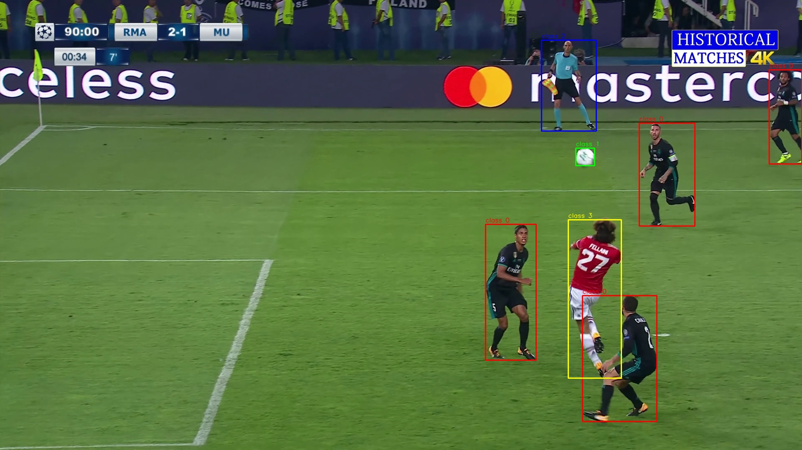

# Polygon to Rectangle Annotation Converter
### Polygon-Based Annotations → YOLO Bounding Box Format

---

## 📌 Overview

This module provides a **robust and production-ready solution** for converting  
**polygon-based object annotations** into **axis-aligned rectangular bounding boxes**
compatible with **YOLO detection format**.

The tool is designed for scenarios where:
- Original annotations are stored as **polygons**
- Detection models require **rectangular bounding boxes**
- Very small or noisy objects must be filtered out
- Visual validation is required before training

---

## 🧠 Motivation

Polygon annotations are commonly used in:
- Segmentation tasks
- Precise object boundary labeling
- Industrial inspection datasets

However, many object detection frameworks (including YOLO detection models)
require **bounding box annotations**.

This module bridges that gap by:
- Computing tight bounding rectangles from polygons
- Applying pixel-based size filtering
- Preserving class labels
- Providing visual inspection utilities

---

## 🗂️ Directory Structure

"""
Polygon-to-Rectangle-format/
│
├── converter.py
│   (Converts polygon annotations into YOLO bounding boxes)
│
├── visualizer.py
│   (Draws YOLO bounding boxes on images for validation)
│
├── image/
│   └── image.jpg
│       (Original input image)
│
├── data/
│   └── mask.txt
│       (Polygon-based annotation file - input)
│
├── converter/
│   └── mask.txt
│       (Converted YOLO bounding box annotation - output)
│
└── visualizer_data/
    └── image_visualized_with_bboxes.jpg
        (Final visualization result)
"""

---

## 🔄 Annotation Conversion Logic

The conversion process follows these steps:

1. Read polygon-based annotation files
2. Extract all `(x, y)` polygon vertices
3. Compute the minimum enclosing rectangle
4. Convert rectangle to YOLO format:
   - Center `(x, y)`
   - Width and height
5. Apply pixel-based filtering to remove very small objects
6. Save annotations in YOLO `.txt` format

---

## ✍️ Annotation Format — Before & After

### 📥 Input: Polygon Annotation (`data/mask.txt`)

"""
0 0.12 0.34 0.18 0.36 0.20 0.40 0.15 0.42
1 0.55 0.60 0.58 0.62 0.61 0.65 0.57 0.67
"""

Each line represents:
- `class_id`
- Followed by polygon vertices `(x1 y1 x2 y2 ... xn yn)`
- All coordinates are **normalized**

---

### 📤 Output: YOLO Bounding Box (`converter/mask.txt`)

"""
0 0.16 0.38 0.08 0.08
1 0.59 0.63 0.06 0.07
"""

Each line now represents:
- `class_id`
- `x_center y_center width height`
- Fully compatible with **YOLO detection models**

---

## 🧮 Pixel-Based Size Filtering

To prevent noisy annotations, the converter applies a **minimum pixel size filter**.

Filtering logic:
- Bounding box width and height are converted to pixel space
- If **both edges are smaller than a defined threshold**, the box is discarded

This ensures:
- Cleaner datasets
- Fewer false positives
- Better training stability

---

## ▶ Step 1 — Convert Polygons to Bounding Boxes

Run the conversion script:

"""
python converter.py
"""

What this script does:
- Reads polygon annotations from `data/`
- Converts them to YOLO bounding boxes
- Writes results into `converter/`

---

## ▶ Step 2 — Visualize Bounding Boxes

To verify the conversion, run:

"""
python visualizer.py
"""

This script:
- Loads the original image
- Reads YOLO bounding boxes
- Draws class-colored rectangles
- Saves the visualization result

---

## 🖼️ Visual Results

### Original Image

---

### Bounding Box Visualization

---

## ⚙️ Installation & Requirements

### Python Version
- Python **3.8 or higher**

### Required Packages

"""
pip install opencv-python matplotlib numpy
"""

No deep learning frameworks are required.

---

## ✅ Key Advantages

- Accurate polygon-to-rectangle conversion
- Pixel-level noise filtering
- YOLO-compatible output
- Visual verification support
- Clean, modular, and extensible design

---

## 📌 Typical Use Cases

- Converting segmentation-style annotations for detection models
- Preparing datasets for YOLO training
- Cleaning noisy annotation data
- Industrial vision pipelines
- Research and benchmarking workflows

---

## 🔮 Possible Extensions

- Oriented bounding box (OBB) support
- Multi-instance statistics reporting
- CLI interface with argparse
- Automatic image-size detection
- Batch dataset validation reports

---

## 👤 Author

**Furkan Karakaya**  
AI & Computer Vision Engineer  
📧 se.furkankarakaya@gmail.com  

---

⭐ If you find this module useful, feel free to star the repository or contribute improvements.
