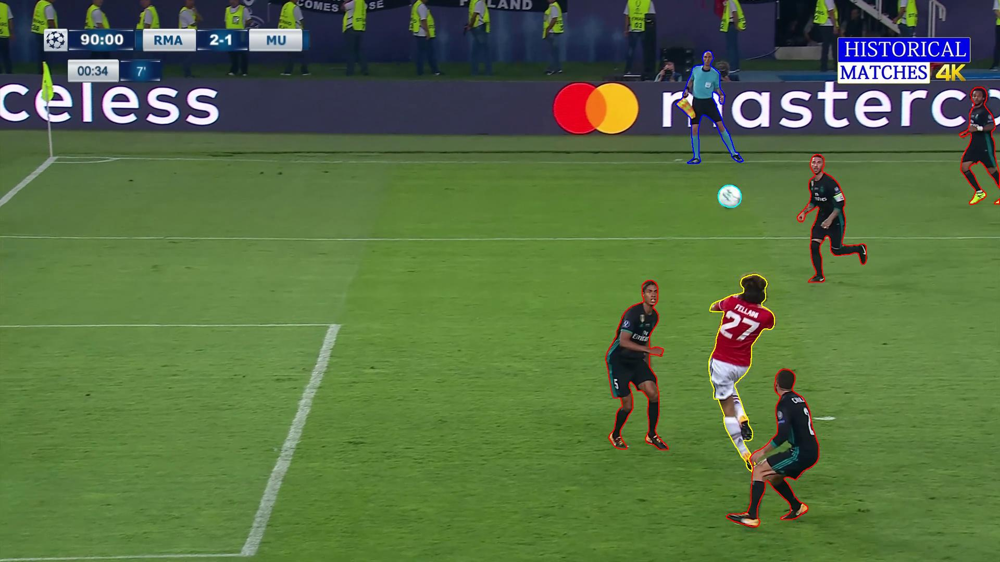

# Segmentation Mask to YOLO Format Converter
### Color-Coded Segmentation → YOLOv8 Polygon Annotations


---

## 📌 Overview

This module provides a clean, practical, and extensible pipeline for converting
color-coded segmentation masks into YOLOv8-compatible polygon annotations.

It is designed for dataset engineers, computer vision researchers, and practitioners
who work with segmentation masks but need to train YOLO-style segmentation models.

The workflow consists of three clearly separated stages:

1. Inspect segmentation mask colors
2. Convert segmentation masks into YOLO polygon annotations
3. Visually validate generated annotations

---

## 🧠 Motivation

Segmentation datasets are often stored as RGB masks where:

- Each semantic class is encoded with a unique color
- Masks are not directly compatible with YOLO segmentation format
- Manual conversion is error-prone and inefficient

This module addresses these issues by providing:

- Pixel-accurate RGB inspection
- Deterministic color-to-class mapping
- Robust contour-to-polygon conversion
- Visual verification of annotations

---

## 🗂️ Directory Structure

```text

Seg-to-Yolo-format/
│
├── converter.py
│   (Converts RGB segmentation masks into YOLO polygon annotations)
│
├── mask_rgb_picker.py
│   (Interactive tool to inspect RGB values in segmentation masks)
│
├── visualizer.py
│   (Draws YOLO polygons on images for visual validation)
│
└── data/
    ├── images/
    │   └── image.jpg
    │       (Original input image)
    │
    ├── masks/
    │   └── mask.png
    │       (Color-coded segmentation mask)
    │
    ├── txt_data/
    │   └── mask.txt
    │       (Generated YOLO segmentation annotation)
    │
    └── visualizer_data/
        └── image_visualized_with_polygons.jpg
            (Final visualization result)
            
```
---

## 🔍 Step 1 — Inspect Mask Colors (mask_rgb_picker.py)

Before converting segmentation masks, the exact RGB values used for each class
must be identified.

This script opens a segmentation mask image and displays the RGB value of the
pixel under the mouse cursor in real time.

On mouse click, the selected RGB value is printed to the terminal, allowing
precise definition of class color mappings.

Typical usage:

- Move the mouse over the mask to inspect RGB values
- Left-click to print the RGB value
- Use the printed values to define COLOR_TO_CLASS mappings

---

## 🔄 Step 2 — Convert Segmentation Masks (converter.py)

This script performs the core conversion from RGB segmentation masks to YOLO
segmentation format.

Conversion logic:

1. Load RGB segmentation mask
2. Extract binary masks for predefined RGB colors
3. Detect object contours
4. Convert contours into polygon representations
5. Normalize polygon coordinates to [0, 1]
6. Write YOLO-compatible annotation files

Output format (YOLOv8 segmentation):

<class_id> x1 y1 x2 y2 x3 y3 ...

Each line corresponds to one object instance.

Generated annotation files are saved under:

data/txt_data/

---

## 🖼️ Step 3 — Visual Validation (visualizer.py)

To verify the correctness of generated annotations, this script overlays YOLO
polygon annotations on the original image.

Features:

- Class-specific polygon colors
- Accurate scaling from normalized coordinates
- Fast visual inspection of annotation quality

---

## 🖼️ Example Results

Original Image:


Segmentation Mask:


YOLO Polygon Visualization:



---

## ⚙️ Installation & Requirements

This module is intentionally lightweight and dependency-minimal.

Recommended Python version:
- Python 3.8 or newer

Required Python packages:
- opencv-python
- pillow
- numpy

No deep learning frameworks are required.

---

## ✅ Key Advantages

- Pixel-accurate RGB-based class extraction
- Fully YOLOv8-compatible segmentation output
- Modular and readable codebase
- Easy integration into existing dataset pipelines
- Suitable for research and industrial workflows

---

## 📌 Use Cases

- Preparing segmentation datasets for YOLOv8
- Converting industrial color-coded masks
- Dataset verification and debugging
- Academic research and experimentation
- Automated annotation pipelines

---

## 🔮 Possible Extensions

- RGB tolerance support for noisy masks
- Polygon simplification for complex contours
- Hole-aware contour handling
- Command-line interface integration
- Batch visualization utilities

---

## 👤 Author

Furkan Karakaya  
AI & Computer Vision Engineer  
Email: se.furkankarakaya@gmail.com  

---

⭐ If you find this module useful, consider starring the repository or contributing improvements.
